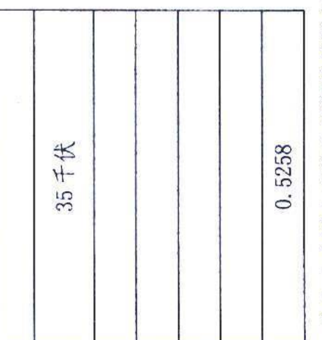
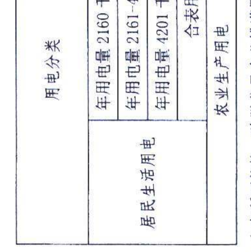

发展和改革委员会 49 源

皖发改价格 [2021] 535 号 安徽省发展改革委安徽省能源局关于 贯彻落实进一步深化燃煤发电上网电价 市场化改革有关要求的通知 各市发展改革委(能源局),国网安徽省电力有限公司、有关发 电 企业:
根据《国家发展改革委关于进一步深化燃煤发电上网电价市 场化改革的通知》 ( 发改价格 [2021] 1439 号 ) 精神,结合我省 实际, 现就进一步深化燃煤发电上网电价市场化改革有关事项通 知 一,放开燃煤发电上网电价。 首 2021 年 10 月 15 日起,燃 煤发电电量原则上全部进入电力市场,在"基准价+上下浮动"范围 肉形成王网电价,上下浮动范围原则上均不超过 20%,高耗能企 业市场交易世价不受上浮 20%限制.

二、全面取消工商业目录销售电价。 自 10 月 15 日起,取消 我省工商业目录销售电度电价,基本电价、峰谷分时电价等继续 按现行政策执行。

三、建立代理购电机制。取消工商业目录销售电价后,工商 业用户全部进入电力市场,按照市场价格购电。对暂未直接从电 力市场购电的用户由电网企业代理购电,具体代理购电方案易行 制定。已参与市场交易、改为电网企业代理购电的用户,其价格 按电网企业代理其他用户购电价格的 1.5 倍执行。

四、保持居民和农业用电价格稳定。居民(含执行居民电价 的学校,社会福利机构,社区服务中心等公益性事业用户)、农 业用电网保障供应,继续执行现行目录销售电价(具体见附 ष ) .

五、抓紧开展年内交易工作。10 月 15 日前已签订的市场化 交易合同由双方协商。 10 月 15 目后,新增年内集中交易成交价 格全额传导至用户。发电企业、一级用户、售电公司超出市场化 交易合同部分的电量,暂按当月月度集中交易平均价格结算。

本通知与国家后续政策不一致的,按国家规定执行。执行中 如有问题,请及时反馈省发展改革委(价格处)、省能源局(电 力 处 ) 。

:安徽电网销售电价表 221 年 10 月 25 日

附件

# 安徽电网销售电价

## 年

| 元/千瓦时   | l-10 千伏   | 0.5503   | 0.6003   | 0.8503   | 0.5703   | 0.5408   |
|-------------|-------------|----------|----------|----------|----------|----------|
| 电度电价 (  | 不滿 1 千伏 | 0.5653   | 0.6153   | 0.8653   | 0.5853   | 0. 5558  |
| 合表用户    |             |          |          |          |          |          |

年用电量 4201 千瓦时及以上 年用电量 2160 千瓦时及以 年用屯量 2161-4200 千瓦时 合表用户

1. 上表所列价格,降股贫县农业排灌用电外,均含国家重大水利工程建设基金0.364分钱,除农业生产用电外,均含大中型水库移民后期扶持贫金0.623分钱 2. 农业排灌用电在农业生产用电价格基础上降低2分钱/千瓦时,脱贫县农业排灌用电在农业生产用电价格基础上降低20. 42分钱/千瓦时 注:
e time the state of Copyright 2017 Cengage Learning. All Rights Reserved. May not be copied, scanned, or duplicated, in whole or in part. Due to electronic rights, some third party content may b 抄送: 国家发展改革委, 省政府办公厅, 省经济种信息化厅,省市 场皆皆皆 安徽省发展和改革委员会办公室 21 年 10 月 25 日印发